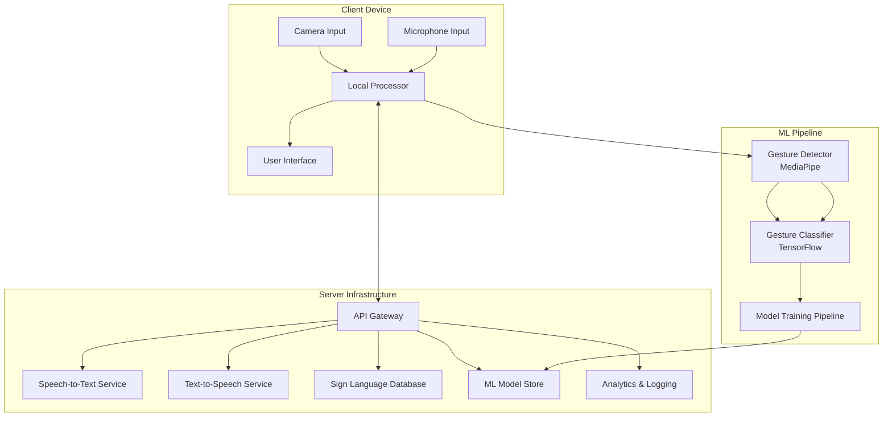

# Design Document: SanketVani

## Overview

SanketVani is a real-time, AI-powered communication platform that enables bidirectional translation between sign language, text, and speech. The system architecture follows a modular design with clear separation between input processing, machine learning inference, and output generation. The platform processes video input locally on client devices to ensure privacy, uses MediaPipe for hand landmark detection, TensorFlow for gesture classification, and integrates speech-to-text and text-to-speech APIs for audio processing.

The system is designed to be:
- **Real-time**: End-to-end latency under 1 second
- **Accurate**: 90%+ gesture classification accuracy
- **Privacy-preserving**: Local video processing, encrypted data transmission
- **Scalable**: Horizontal scaling for institutional deployments
- **Accessible**: Works on standard cameras without specialized hardware
- **Cross-platform**: Web, desktop, and mobile support

## Architecture

### High-Level Architecture



### Component Architecture

The system consists of the following major components:

1. **Input Layer**: Captures camera, microphone, text, and document inputs
2. **Processing Layer**: Handles gesture detection, ML classification, and translation logic
3. **Output Layer**: Generates text, speech, and sign language visualizations
4. **Communication Layer**: Manages real-time video calls and data synchronization
5. **Storage Layer**: Manages ML models, sign language databases, and user data
6. **API Layer**: Provides interfaces for external services (STT, TTS)

## Components and Interfaces

### 1. Camera Input Manager

**Responsibility**: Manages camera access, frame capture, and preprocessing.

**Interface**:
```python
class CameraInputManager:
    def initialize_camera(device_id: int = 0) -> bool
    def get_frame() -> np.ndarray
    def release_camera() -> None
    def set_resolution(width: int, height: int) -> bool
    def adjust_settings(brightness: float, contrast: float) -> bool
    def get_available_cameras() -> List[CameraDevice]
```

**Implementation Details**:
- Uses OpenCV for camera access and frame capture
- Supports multiple camera sources (webcam, mobile, external)
- Applies automatic image enhancement for low-light conditions
- Maintains frame buffer for smooth processing
- Target: 30 FPS minimum, supports 15-60 FPS range

**Dependencies**: OpenCV, platform-specific camera APIs

### 2. Gesture Detector

**Responsibility**: Detects hand landmarks from camera frames using MediaPipe.

**Interface**:
```python
class GestureDetector:
    def detect_hands(frame: np.ndarray) -> List[HandLandmarks]
    def get_landmark_coordinates(hand: HandLandmarks) -> np.ndarray
    def is_hand_in_frame(hand: HandLandmarks) -> bool
    def get_hand_orientation(hand: HandLandmarks) -> Orientation
    def distinguish_left_right(hands: List[HandLandmarks]) -> Dict[str, HandLandmarks]
```

**Data Structures**:
```python
@dataclass
class HandLandmarks:
    landmarks: np.ndarray  # Shape: (21, 3) - x, y, z coordinates
    handedness: str  # "Left" or "Right"
    confidence: float
    timestamp: float

@dataclass
class Orientation:
    palm_direction: np.ndarray
    finger_direction: np.ndarray
    rotation: float
```

**Implementation Details**:
- Uses MediaPipe Hands solution for landmark detection
- Tracks 21 landmarks per hand (thumb, fingers, palm, wrist)
- Processes frames at 30+ FPS
- Handles partial occlusion and rapid movements
- Normalizes coordinates relative to frame size
- Target latency: <100ms per frame

**Dependencies**: MediaPipe, NumPy

### 3. Feature Extractor

**Responsibility**: Converts hand landmarks into feature vectors for ML classification.

**Interface**:
```python
class FeatureExtractor:
    def extract_features(landmarks: HandLandmarks) -> np.ndarray
    def normalize_features(features: np.ndarray) -> np.ndarray
    def compute_hand_shape_features(landmarks: HandLandmarks) -> np.ndarray
    def compute_motion_features(landmark_sequence: List[HandLandmarks]) -> np.ndarray
```

**Feature Engineering**:
- **Spatial Features**: Distances between landmarks, angles between fingers
- **Shape Features**: Hand openness, finger curl, palm orientation
- **Motion Features**: Velocity, acceleration, trajectory of landmarks
- **Temporal Features**: Gesture duration, movement patterns over time
- Feature vector size: 128 dimensions (configurable)

**Implementation Details**:
- Computes relative positions to make features scale-invariant
- Applies normalization to handle different hand sizes
- Uses sliding window for temporal features (5-10 frames)
- Caches computed features for efficiency

**Dependencies**: NumPy, SciPy

### 4. Gesture Classifier

**Responsibility**: Classifies extracted features into sign language gestures using TensorFlow.

**Interface**:
```python
class GestureClassifier:
    def load_model(model_path: str) -> bool
    def classify_gesture(features: np.ndarray) -> GestureResult
    def classify_batch(features: List[np.ndarray]) -> List[GestureResult]
    def get_model_version() -> str
    def update_model(new_model_path: str) -> bool

@dataclass
class GestureResult:
    gesture_id: str
    gesture_name: str
    confidence: float
    alternatives: List[Tuple[str, float]]  # Top-k alternatives
    timestamp: float
```

**Model Architecture**:
- **Input Layer**: 128-dimensional feature vector
- **Hidden Layers**: 3 fully connected layers (256, 128, 64 neurons)
- **Activation**: ReLU for hidden layers
- **Output Layer**: Softmax over gesture classes
- **Regularization**: Dropout (0.3), L2 regularization
- **Training**: Adam optimizer, categorical cross-entropy loss

**Model Training**:
- Dataset: 1,000+ examples per gesture class
- Train/validation/test split: 70/15/15
- Data augmentation: rotation, scaling, noise injection
- Target accuracy: 90%+ on validation set
- Batch size: 32, Epochs: 50-100 with early stopping

**Implementation Details**:
- Uses TensorFlow/Keras for model implementation
- Supports model versioning and hot-swapping
- Implements confidence thresholding (80% minimum)
- Returns top-k predictions for ambiguous gestures
- Target inference time: <50ms per gesture

**Dependencies**: TensorFlow, Keras, NumPy

### 5. Translation Engine

**Responsibility**: Converts between sign language, text, and speech representations.

**Interface**:
```python
class TranslationEngine:
    def sign_to_text(gestures: List[GestureResult]) -> str
    def text_to_signs(text: str) -> List[SignRepresentation]
    def speech_to_text(audio: np.ndarray) -> str
    def text_to_speech(text: str, voice_config: VoiceConfig) -> np.ndarray
    def combine_gestures(gestures: List[GestureResult]) -> str

@dataclass
class SignRepresentation:
    sign_id: str
    sign_name: str
    animation_path: str
    duration: float
    description: str

@dataclass
class VoiceConfig:
    voice_type: str  # "male", "female", "neutral"
    speed: float  # 0.5 to 2.0
    volume: float  # 0.0 to 1.0
    language: str  # "en-US", "hi-IN", etc.
```

**Implementation Details**:

**Sign to Text**:
- Maintains gesture buffer for context-aware translation
- Implements grammar rules for combining gestures into words/phrases
- Handles finger-spelling for proper nouns
- Uses language model for sentence construction

**Text to Signs**:
- Parses input text into words and phrases
- Looks up sign representations in sign language database
- Falls back to finger-spelling for unknown words
- Generates animation sequences with proper timing

**Speech to Text**:
- Integrates with Google Speech-to-Text or similar API
- Applies noise filtering before recognition
- Implements confidence thresholding (70% minimum)
- Supports multiple languages

**Text to Speech**:
- Integrates with Google Text-to-Speech or similar API
- Supports voice customization
- Handles SSML for pronunciation control
- Generates audio in real-time

**Dependencies**: Google Cloud Speech-to-Text, Google Cloud Text-to-Speech, NLTK

### 6. Sign Language Database

**Responsibility**: Stores and retrieves sign language gesture definitions and animations.

**Interface**:
```python
class SignLanguageDatabase:
    def get_sign_by_word(word: str) -> SignRepresentation
    def get_sign_by_id(sign_id: str) -> SignRepresentation
    def search_signs(query: str) -> List[SignRepresentation]
    def add_sign(sign: SignRepresentation) -> bool
    def update_sign(sign_id: str, sign: SignRepresentation) -> bool
    def get_fingerspelling_sequence(word: str) -> List[SignRepresentation]
```

**Database Schema**:
```python
@dataclass
class SignEntry:
    sign_id: str  # Unique identifier
    word: str  # English word or phrase
    category: str  # "alphabet", "word", "phrase", "number"
    animation_url: str  # Path to animation file
    video_url: str  # Path to video demonstration
    description: str
    difficulty: str  # "basic", "intermediate", "advanced"
    usage_frequency: int
    related_signs: List[str]
    metadata: Dict[str, Any]
```

**Implementation Details**:
- Uses SQLite for local storage, PostgreSQL for server deployment
- Indexes on word, category, and sign_id for fast lookup
- Stores animation files as MP4 or GIF
- Supports multiple sign language variants (ASL, ISL, BSL)
- Implements caching for frequently accessed signs

**Dependencies**: SQLite/PostgreSQL, SQLAlchemy

### 7. Document Converter

**Responsibility**: Extracts text from PDF/DOC files and converts to sign language.

**Interface**:
```python
class DocumentConverter:
    def extract_text_from_pdf(file_path: str) -> str
    def extract_text_from_doc(file_path: str) -> str
    def convert_document_to_signs(file_path: str) -> DocumentTranslation
    def get_conversion_progress() -> float

@dataclass
class DocumentTranslation:
    original_text: str
    sign_sequences: List[List[SignRepresentation]]
    page_markers: List[int]
    total_duration: float
```

**Implementation Details**:
- Uses PyPDF2 or pdfplumber for PDF text extraction
- Uses python-docx for DOC/DOCX files
- Handles documents up to 10MB, 10,000 words
- Splits text into manageable chunks for translation
- Provides progress callbacks for long documents
- Skips images and unsupported content types

**Dependencies**: PyPDF2/pdfplumber, python-docx

### 8. Video Call Manager

**Responsibility**: Manages real-time video calls with integrated translation.

**Interface**:
```python
class VideoCallManager:
    def initiate_call(peer_id: str) -> CallSession
    def accept_call(call_id: str) -> CallSession
    def end_call(call_id: str) -> None
    def send_video_frame(call_id: str, frame: np.ndarray) -> None
    def receive_video_frame(call_id: str) -> np.ndarray
    def send_translation(call_id: str, translation: str) -> None
    def receive_translation(call_id: str) -> str

@dataclass
class CallSession:
    call_id: str
    peer_id: str
    start_time: float
    status: str  # "connecting", "active", "ended"
    translation_enabled: bool
    transcript: List[TranslationEntry]

@dataclass
class TranslationEntry:
    timestamp: float
    speaker: str
    original: str
    translated: str
    mode: str  # "sign-to-text", "text-to-sign", etc.
```

**Implementation Details**:
- Uses WebRTC for peer-to-peer video streaming
- Falls back to server-mediated connection if P2P fails
- Implements adaptive bitrate for varying network conditions
- Overlays translation text on video feed
- Buffers translations during network latency
- Saves transcripts with user consent
- Target connection time: <3 seconds

**Dependencies**: WebRTC, aiortc (Python WebRTC), Socket.IO

### 9. User Interface

**Responsibility**: Provides accessible interface for all system interactions.

**Interface Components**:

**Main Translation View**:
- Camera feed display (640x480 minimum)
- Real-time translation output (text display)
- Input mode selector (sign/speech/text)
- Output mode selector (text/speech/sign)
- Settings panel

**Video Call View**:
- Local and remote video feeds
- Translation overlay
- Call controls (mute, end, settings)
- Transcript panel

**Document Translation View**:
- File upload area
- Progress indicator
- Sign language playback controls
- Navigation controls (page/chapter)

**Settings Panel**:
- Camera selection
- Voice configuration
- Language selection
- Accessibility options (font size, contrast)
- Privacy settings

**Implementation Details**:
- Built with React for web interface
- Uses Material-UI for accessible components
- Implements WCAG 2.1 Level AA compliance
- Supports keyboard navigation
- Provides high contrast mode
- Responsive design for mobile and desktop

**Dependencies**: React, Material-UI, WebRTC APIs

### 10. API Gateway

**Responsibility**: Routes requests to appropriate services and handles authentication.

**Interface**:
```python
class APIGateway:
    def route_request(request: Request) -> Response
    def authenticate_user(token: str) -> User
    def rate_limit_check(user_id: str) -> bool
    def log_request(request: Request, response: Response) -> None
```

**Endpoints**:
- `POST /api/v1/translate/sign-to-text`: Sign language to text translation
- `POST /api/v1/translate/text-to-sign`: Text to sign language translation
- `POST /api/v1/translate/speech-to-text`: Speech to text conversion
- `POST /api/v1/translate/text-to-speech`: Text to speech conversion
- `POST /api/v1/document/convert`: Document to sign language conversion
- `GET /api/v1/signs/{sign_id}`: Retrieve sign representation
- `POST /api/v1/call/initiate`: Initiate video call
- `POST /api/v1/feedback`: Submit translation feedback

**Implementation Details**:
- Built with FastAPI for high performance
- Implements JWT authentication
- Rate limiting: 100 requests per minute per user
- Request/response logging for analytics
- CORS configuration for web clients
- API versioning for backward compatibility

**Dependencies**: FastAPI, uvicorn, JWT libraries

## Data Models

### Core Data Structures

```python
# Hand Landmark Data
@dataclass
class HandLandmarks:
    landmarks: np.ndarray  # (21, 3) array of x, y, z coordinates
    handedness: str  # "Left" or "Right"
    confidence: float  # 0.0 to 1.0
    timestamp: float  # Unix timestamp
    frame_id: int

# Gesture Classification Result
@dataclass
class GestureResult:
    gesture_id: str
    gesture_name: str
    confidence: float
    alternatives: List[Tuple[str, float]]
    timestamp: float
    features: np.ndarray  # Feature vector used for classification

# Sign Language Representation
@dataclass
class SignRepresentation:
    sign_id: str
    sign_name: str
    word: str
    animation_path: str
    video_path: str
    duration: float
    description: str
    category: str
    difficulty: str

# Translation Session
@dataclass
class TranslationSession:
    session_id: str
    user_id: str
    start_time: float
    end_time: Optional[float]
    input_mode: str  # "sign", "speech", "text"
    output_mode: str  # "text", "speech", "sign"
    translations: List[TranslationEntry]
    accuracy_feedback: List[FeedbackEntry]

# Translation Entry
@dataclass
class TranslationEntry:
    timestamp: float
    input_data: Any  # Gesture, audio, or text
    output_data: str
    confidence: float
    latency: float  # Processing time in milliseconds

# Feedback Entry
@dataclass
class FeedbackEntry:
    timestamp: float
    translation_id: str
    correct: bool
    corrected_output: Optional[str]
    user_comment: Optional[str]

# Video Call Session
@dataclass
class CallSession:
    call_id: str
    participants: List[str]
    start_time: float
    end_time: Optional[float]
    status: str
    translation_enabled: bool
    transcript: List[TranslationEntry]
    network_quality: List[NetworkMetric]

# Network Metric
@dataclass
class NetworkMetric:
    timestamp: float
    latency: float  # milliseconds
    packet_loss: float  # percentage
    bandwidth: float  # Mbps
```

### Database Schema

**Users Table**:
```sql
CREATE TABLE users (
    user_id VARCHAR(36) PRIMARY KEY,
    username VARCHAR(100) UNIQUE NOT NULL,
    email VARCHAR(255) UNIQUE NOT NULL,
    created_at TIMESTAMP DEFAULT CURRENT_TIMESTAMP,
    preferred_input_mode VARCHAR(20),
    preferred_output_mode VARCHAR(20),
    language VARCHAR(10) DEFAULT 'en-US'
);
```

**Signs Table**:
```sql
CREATE TABLE signs (
    sign_id VARCHAR(36) PRIMARY KEY,
    word VARCHAR(255) NOT NULL,
    category VARCHAR(50),
    animation_url TEXT,
    video_url TEXT,
    description TEXT,
    difficulty VARCHAR(20),
    usage_frequency INTEGER DEFAULT 0,
    created_at TIMESTAMP DEFAULT CURRENT_TIMESTAMP,
    INDEX idx_word (word),
    INDEX idx_category (category)
);
```

**Translation Sessions Table**:
```sql
CREATE TABLE translation_sessions (
    session_id VARCHAR(36) PRIMARY KEY,
    user_id VARCHAR(36) REFERENCES users(user_id),
    start_time TIMESTAMP NOT NULL,
    end_time TIMESTAMP,
    input_mode VARCHAR(20),
    output_mode VARCHAR(20),
    total_translations INTEGER DEFAULT 0,
    average_latency FLOAT,
    INDEX idx_user_id (user_id),
    INDEX idx_start_time (start_time)
);
```

**Feedback Table**:
```sql
CREATE TABLE feedback (
    feedback_id VARCHAR(36) PRIMARY KEY,
    session_id VARCHAR(36) REFERENCES translation_sessions(session_id),
    timestamp TIMESTAMP NOT NULL,
    gesture_id VARCHAR(36),
    correct BOOLEAN,
    corrected_output TEXT,
    user_comment TEXT,
    INDEX idx_session_id (session_id),
    INDEX idx_timestamp (timestamp)
);
```

**ML Models Table**:
```sql
CREATE TABLE ml_models (
    model_id VARCHAR(36) PRIMARY KEY,
    version VARCHAR(20) NOT NULL,
    model_path TEXT NOT NULL,
    accuracy FLOAT,
    created_at TIMESTAMP DEFAULT CURRENT_TIMESTAMP,
    deployed_at TIMESTAMP,
    status VARCHAR(20),  -- 'training', 'testing', 'deployed', 'archived'
    INDEX idx_version (version),
    INDEX idx_status (status)
);
```

## Correctness Properties

*A property is a characteristic or behavior that should hold true across all valid executions of a system—essentially, a formal statement about what the system should do. Properties serve as the bridge between human-readable specifications and machine-verifiable correctness guarantees.*


### Property 1: Gesture Detection Latency

*For any* sign language gesture performed in front of the camera, the Gesture_Detector should detect hand landmarks within 100 milliseconds.

**Validates: Requirements 1.1**

### Property 2: Classification Latency

*For any* detected hand landmarks, the Classifier should classify the gesture and output text within 900 milliseconds.

**Validates: Requirements 1.2**

### Property 3: End-to-End Translation Latency

*For any* gesture classification, the System should display the translated text on screen within 1 second of gesture completion.

**Validates: Requirements 1.3, 11.3**

### Property 4: Gesture Combination Coherence

*For any* sequence of multiple gestures that form a word or phrase, the Translator should combine them into coherent text output.

**Validates: Requirements 1.5**

### Property 5: Classifier Accuracy Threshold

*For any* validation dataset of standard sign language gestures, the Classifier should achieve a minimum accuracy of 90%.

**Validates: Requirements 1.6, 8.2**

### Property 6: Text-to-Speech Conversion Latency

*For any* text successfully translated from gestures, the System should convert the text to speech within 500 milliseconds.

**Validates: Requirements 2.1**

### Property 7: Continuous Speech Output Timing

*For any* sequence of multiple consecutive gestures, the System should support continuous speech output without audio gaps exceeding 200 milliseconds.

**Validates: Requirements 2.5**

### Property 8: Speech-to-Text Conversion Latency

*For any* audio input received from the microphone, the System should convert speech to text within 1 second.

**Validates: Requirements 3.2**

### Property 9: Text-to-Sign Lookup Latency

*For any* text generated from speech, the System should identify corresponding sign language gestures within 500 milliseconds.

**Validates: Requirements 3.3, 4.2**

### Property 10: Sign Language Display

*For any* identified sign language gestures, the System should display animated or video representations of the signs.

**Validates: Requirements 3.4, 4.3**

### Property 11: Confidence Thresholding

*For any* gesture classification or speech recognition result with confidence below the threshold (80% for gestures, 70% for speech), the System should request user confirmation or repetition.

**Validates: Requirements 3.5, 8.3**

### Property 12: Background Noise Filtering

*For any* audio input containing background noise, the System should apply filtering before speech recognition.

**Validates: Requirements 3.6**

### Property 13: Text Input Validation

*For any* user text input, the System should accept alphanumeric characters and common punctuation.

**Validates: Requirements 4.1**

### Property 14: Sign Order Preservation

*For any* input text, the System should display signs in the correct sequential order matching the input text structure.

**Validates: Requirements 4.4**

### Property 15: Finger-Spelling Fallback

*For any* word without a direct sign equivalent, the System should use finger-spelling representation.

**Validates: Requirements 4.5**

### Property 16: Document Text Extraction Latency

*For any* PDF or DOC file up to 10MB, the Document_Converter should extract text content within 5 seconds.

**Validates: Requirements 5.1**

### Property 17: Document Translation Consistency

*For any* text extracted from a document, the System should translate it to sign language following the same process as text-to-sign translation, producing identical results for identical text.

**Validates: Requirements 5.2**

### Property 18: Document Translation Progress Reporting

*For any* document translation in progress, the System should display a progress indicator showing percentage completion.

**Validates: Requirements 5.4**

### Property 19: Unsupported Content Handling

*For any* document containing unsupported content types, the System should skip those sections and notify the user.

**Validates: Requirements 5.5**

### Property 20: Video Call Connection Latency

*For any* video call initiation, the System should establish a peer-to-peer or server-mediated connection within 3 seconds.

**Validates: Requirements 6.1**

### Property 21: Continuous Gesture Processing During Calls

*For any* active video call, the System should continuously process camera input for gesture detection throughout the call duration.

**Validates: Requirements 6.2**

### Property 22: Translation Overlay Display

*For any* translation during an active video call, the System should display translated text or signs as an overlay on the video feed.

**Validates: Requirements 6.3**

### Property 23: Network Latency Notification

*For any* video call where network latency exceeds 2 seconds, the System should notify users of potential translation delays.

**Validates: Requirements 6.4**

### Property 24: Bidirectional Translation Support

*For any* active video call, the System should support simultaneous bidirectional translation in both directions.

**Validates: Requirements 6.5**

### Property 25: Transcript Saving with Consent

*For any* video call that ends, the System should save a transcript of the translated conversation if and only if the user has opted in.

**Validates: Requirements 6.6, 12.3**

### Property 26: Hand Landmark Count

*For any* camera input with visible hands, the Gesture_Detector should identify and track exactly 21 hand landmarks per hand.

**Validates: Requirements 7.1**

### Property 27: Tracking Robustness

*For any* hand gestures where hands partially overlap or move rapidly, the Gesture_Detector should maintain tracking accuracy.

**Validates: Requirements 7.2**

### Property 28: Low-Light Image Enhancement

*For any* camera input with suboptimal lighting conditions, the Gesture_Detector should apply image enhancement before landmark detection.

**Validates: Requirements 7.3**

### Property 29: Frame Processing Rate

*For any* camera frame sequence, the Gesture_Detector should process frames at a minimum of 30 frames per second.

**Validates: Requirements 7.4**

### Property 30: Out-of-Frame Detection

*For any* scenario where hands move outside the camera frame, the System should prompt the user to reposition.

**Validates: Requirements 7.5**

### Property 31: Handedness Detection

*For any* detected hands, the Gesture_Detector should correctly distinguish between left and right hands for signs requiring hand-specific interpretation.

**Validates: Requirements 7.6**

### Property 32: Incremental Learning

*For any* user feedback on incorrect translations, the Classifier should support incremental learning to improve accuracy over time.

**Validates: Requirements 8.4**

### Property 33: Confidence Score Logging

*For any* gesture classification, the System should store classification confidence scores for quality monitoring and model improvement.

**Validates: Requirements 8.5, 13.6**

### Property 34: Variation Robustness

*For any* gestures with variations in hand size, skin tone, or gesture speed, the Classifier should maintain accuracy without degradation.

**Validates: Requirements 8.6**

### Property 35: Automatic Camera Adjustment

*For any* camera input, the System should automatically adjust camera settings including brightness, contrast, and focus for optimal detection.

**Validates: Requirements 9.4**

### Property 36: Keyboard Navigation Accessibility

*For any* interactive UI element, the System should support keyboard navigation.

**Validates: Requirements 10.2**

### Property 37: Dual Error Display

*For any* error that occurs, the System should display error messages in both text and visual indicators.

**Validates: Requirements 10.3, 14.5**

### Property 38: Responsive Layout Consistency

*For any* screen size or device, the System should maintain a consistent layout.

**Validates: Requirements 10.6**

### Property 39: Concurrent Session Capacity

*For any* standard server configuration, the System should support at least 100 concurrent translation sessions.

**Validates: Requirements 11.1**

### Property 40: Load-Based Request Queueing

*For any* scenario where system load exceeds 80% capacity, the System should queue new requests and notify users of expected wait time.

**Validates: Requirements 11.2**

### Property 41: Video Compression

*For any* video streaming, the System should use efficient data compression to minimize bandwidth requirements.

**Validates: Requirements 11.5**

### Property 42: Horizontal Scalability

*For any* increased user demand, the System should scale horizontally by adding server instances to handle the load.

**Validates: Requirements 11.6**

### Property 43: Local Video Processing

*For any* video input, the System should process it locally on the user device without transmitting raw video to external servers.

**Validates: Requirements 12.1**

### Property 44: Encrypted Data Transmission

*For any* translation data transmitted over the network, the System should encrypt all data using TLS 1.3 or higher.

**Validates: Requirements 12.2**

### Property 45: Data Anonymization

*For any* stored data when users opt in to data collection, the System should anonymize all stored data by removing personally identifiable information.

**Validates: Requirements 12.4**

### Property 46: Feedback Logging

*For any* user feedback on incorrect translations, the System should log the gesture data and correct label for retraining.

**Validates: Requirements 13.1**

### Property 47: Model Validation Before Deployment

*For any* new model version deployed, the System should validate it against a test suite before replacing the production model.

**Validates: Requirements 13.3**

### Property 48: Post-Update Accuracy Threshold

*For any* model update, the System should maintain a minimum accuracy threshold of 90% after the update.

**Validates: Requirements 13.4**

### Property 49: Camera Reconnection Retry Logic

*For any* camera input failure, the System should attempt to reconnect automatically up to 3 times before notifying the user.

**Validates: Requirements 14.1**

### Property 50: Inference Error Handling

*For any* ML inference failure, the System should log the error and request the user to repeat the gesture.

**Validates: Requirements 14.2**

### Property 51: Network Loss Buffering

*For any* video call where network connectivity is lost, the System should buffer translations locally and sync when connection is restored.

**Validates: Requirements 14.3**

### Property 52: Graceful Quality Degradation

*For any* scenario where system resources are insufficient, the System should reduce processing quality gracefully rather than failing completely.

**Validates: Requirements 14.4**

### Property 53: Error Logging

*For any* error that occurs, the System should maintain a log of errors for debugging and system improvement purposes.

**Validates: Requirements 14.6**

## Error Handling

### Error Categories

The system handles errors across multiple categories:

1. **Input Errors**: Camera failures, microphone failures, invalid text input
2. **Processing Errors**: ML inference failures, translation failures, resource exhaustion
3. **Network Errors**: Connection failures, high latency, packet loss
4. **Permission Errors**: Camera access denied, microphone access denied
5. **Data Errors**: Corrupted files, unsupported formats, invalid data

### Error Handling Strategies

**Camera Input Errors**:
- Automatic reconnection with exponential backoff (3 attempts)
- Clear user guidance for repositioning hands
- Fallback to text/speech input modes
- Error message: "Camera connection lost. Attempting to reconnect... (Attempt X/3)"

**ML Inference Errors**:
- Log error details for debugging
- Request user to repeat gesture
- Provide visual feedback on gesture quality
- Error message: "Unable to recognize gesture. Please try again with clear hand positioning."

**Low Confidence Results**:
- Display confidence score to user
- Request confirmation for results below threshold
- Offer alternative interpretations
- Error message: "Recognition confidence low (X%). Did you mean: [alternatives]?"

**Network Errors**:
- Local buffering of translations during disconnection
- Automatic sync when connection restored
- Notify users of degraded service
- Error message: "Network latency high. Translations may be delayed."

**Resource Exhaustion**:
- Graceful degradation: reduce frame rate, lower resolution
- Queue requests when at capacity
- Provide estimated wait time
- Error message: "System at capacity. Your request is queued (estimated wait: X seconds)."

**Permission Errors**:
- Clear instructions for granting permissions
- Platform-specific guidance (browser, OS)
- Fallback to alternative input modes
- Error message: "Camera access required. Please grant permission in your browser settings."

**Document Processing Errors**:
- Skip unsupported content with notification
- Partial translation for valid sections
- Detailed error reporting
- Error message: "Document contains unsupported content (images, tables). Text sections translated successfully."

### Error Recovery Mechanisms

1. **Automatic Retry**: Camera reconnection, network requests
2. **Fallback Modes**: Switch to alternative input/output modes
3. **Local Buffering**: Store data during network issues
4. **Graceful Degradation**: Reduce quality instead of failing
5. **User Guidance**: Clear instructions for resolution
6. **Error Logging**: Comprehensive logging for debugging

### Error Monitoring

- All errors logged with timestamp, context, and stack trace
- Error rates tracked per component
- Alerts triggered for error rate spikes
- User-facing error dashboard for transparency
- Automated error reports for development team

## Testing Strategy

### Dual Testing Approach

The testing strategy employs both unit testing and property-based testing to ensure comprehensive coverage:

- **Unit Tests**: Verify specific examples, edge cases, and error conditions
- **Property Tests**: Verify universal properties across all inputs using randomized testing

Both approaches are complementary and necessary. Unit tests catch concrete bugs in specific scenarios, while property tests verify general correctness across a wide input space.

### Property-Based Testing Configuration

**Framework**: We will use **Hypothesis** for Python, which is the standard property-based testing library.

**Configuration**:
- Minimum 100 iterations per property test (due to randomization)
- Each property test must reference its design document property
- Tag format: `# Feature: sanketvani, Property {number}: {property_text}`

**Example Property Test Structure**:
```python
from hypothesis import given, strategies as st
import hypothesis

# Feature: sanketvani, Property 1: Gesture Detection Latency
@given(gesture=st.builds(generate_random_gesture))
@hypothesis.settings(max_examples=100)
def test_gesture_detection_latency(gesture):
    start_time = time.time()
    landmarks = gesture_detector.detect_hands(gesture.frame)
    detection_time = (time.time() - start_time) * 1000  # Convert to ms
    
    assert detection_time < 100, f"Detection took {detection_time}ms, expected <100ms"
    assert landmarks is not None
```

### Unit Testing Strategy

**Focus Areas for Unit Tests**:
1. **Specific Examples**: Concrete test cases demonstrating correct behavior
2. **Edge Cases**: Boundary conditions (empty input, maximum size, minimum resolution)
3. **Error Conditions**: Invalid input, missing permissions, network failures
4. **Integration Points**: Component interactions, API contracts

**Unit Test Balance**:
- Avoid writing too many unit tests for scenarios covered by property tests
- Focus unit tests on specific examples that illustrate requirements
- Use unit tests for integration testing between components
- Property tests handle comprehensive input coverage

**Example Unit Test Structure**:
```python
def test_sign_to_text_hello():
    """Test specific example: 'hello' gesture translates to 'hello' text"""
    gesture_sequence = load_test_gesture("hello")
    result = translation_engine.sign_to_text(gesture_sequence)
    assert result == "hello"

def test_empty_gesture_sequence():
    """Edge case: empty gesture sequence"""
    result = translation_engine.sign_to_text([])
    assert result == ""

def test_camera_permission_denied():
    """Error condition: camera access denied"""
    with mock.patch('cv2.VideoCapture', side_effect=PermissionError):
        with pytest.raises(CameraPermissionError) as exc_info:
            camera_manager.initialize_camera()
        assert "grant permission" in str(exc_info.value).lower()
```

### Test Coverage by Component

**Gesture Detector** (MediaPipe):
- Property tests: Detection latency, landmark count, frame rate, handedness detection
- Unit tests: Specific hand poses, edge cases (hands at frame boundary), error cases (no hands visible)

**Gesture Classifier** (TensorFlow):
- Property tests: Classification latency, accuracy threshold, confidence thresholding, variation robustness
- Unit tests: Specific gestures (alphabet, common words), edge cases (ambiguous gestures), error cases (invalid features)

**Translation Engine**:
- Property tests: Gesture combination, sign order preservation, finger-spelling fallback, translation consistency
- Unit tests: Specific phrases, edge cases (unknown words), error cases (empty input)

**Camera Input Manager**:
- Property tests: Automatic adjustment, reconnection retry logic
- Unit tests: Specific camera devices, edge cases (multiple cameras), error cases (camera disconnected)

**Video Call Manager**:
- Property tests: Connection latency, continuous processing, bidirectional translation, network buffering
- Unit tests: Specific call scenarios, edge cases (network interruption), error cases (peer unavailable)

**Document Converter**:
- Property tests: Extraction latency, progress reporting, unsupported content handling
- Unit tests: Specific document formats, edge cases (large documents), error cases (corrupted files)

**API Gateway**:
- Property tests: Encrypted transmission, request queueing, error logging
- Unit tests: Specific API endpoints, edge cases (rate limiting), error cases (authentication failure)

### Integration Testing

**End-to-End Flows**:
1. Sign language to text translation (camera → detector → classifier → translator → UI)
2. Speech to sign language translation (microphone → STT → translator → sign display)
3. Video call with translation (camera → detector → classifier → translator → network → peer)
4. Document to sign language (file upload → text extraction → translator → sign display)

**Integration Test Examples**:
```python
def test_end_to_end_sign_to_text():
    """Integration test: complete sign-to-text pipeline"""
    # Setup
    camera = CameraInputManager()
    detector = GestureDetector()
    classifier = GestureClassifier()
    translator = TranslationEngine()
    
    # Execute
    frame = camera.get_frame()
    landmarks = detector.detect_hands(frame)
    features = FeatureExtractor().extract_features(landmarks[0])
    gesture = classifier.classify_gesture(features)
    text = translator.sign_to_text([gesture])
    
    # Verify
    assert text is not None
    assert len(text) > 0
    assert gesture.confidence > 0.8
```

### Performance Testing

**Latency Tests**:
- Measure end-to-end latency for all translation modes
- Verify latency under various load conditions
- Test with different hardware configurations

**Scalability Tests**:
- Simulate 100+ concurrent users
- Measure server resource utilization
- Verify horizontal scaling effectiveness

**Stress Tests**:
- Test with continuous operation for extended periods
- Verify memory leak prevention
- Test recovery from resource exhaustion

### Accessibility Testing

**Manual Testing**:
- Keyboard-only navigation
- Screen reader compatibility
- High contrast mode verification
- Font size adjustment verification

**Automated Testing**:
- WCAG 2.1 Level AA compliance checks
- Color contrast ratio verification
- ARIA attribute validation

### Security Testing

**Privacy Tests**:
- Verify local video processing (no transmission)
- Verify TLS 1.3 encryption for all network traffic
- Verify data anonymization in stored data
- Verify data deletion functionality

**Penetration Testing**:
- API authentication and authorization
- Input validation and sanitization
- SQL injection prevention
- XSS prevention

### Continuous Integration

**CI Pipeline**:
1. Run all unit tests on every commit
2. Run property tests on every pull request
3. Run integration tests on merge to main branch
4. Run performance tests nightly
5. Generate coverage reports (target: 80%+ coverage)

**Test Automation**:
- Automated test execution on GitHub Actions / GitLab CI
- Automated deployment to staging on passing tests
- Automated rollback on test failures in production

### Test Data Management

**Gesture Dataset**:
- 1,000+ examples per gesture class
- Diverse hand sizes, skin tones, lighting conditions
- Recorded at various frame rates and resolutions
- Labeled by sign language experts

**Validation Dataset**:
- Separate from training data
- Representative of real-world usage
- Updated periodically with user feedback data

**Test Fixtures**:
- Sample video files for testing
- Sample documents (PDF, DOC) for conversion testing
- Mock API responses for external services
- Synthetic gesture data for edge cases

### Quality Metrics

**Target Metrics**:
- Gesture classification accuracy: ≥90%
- End-to-end latency: <1 second
- System uptime: ≥99.5%
- Test coverage: ≥80%
- Property test iterations: ≥100 per test
- Unit test pass rate: 100%
- Integration test pass rate: 100%

**Monitoring**:
- Real-time accuracy tracking
- Latency percentiles (p50, p95, p99)
- Error rates by category
- User satisfaction scores
- Model performance drift detection
